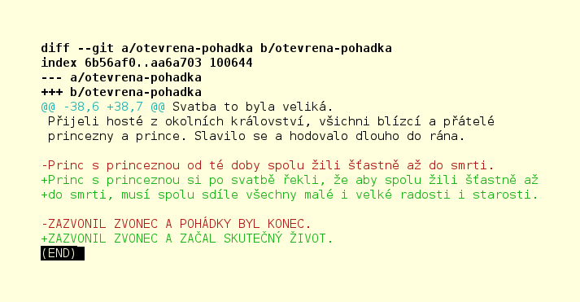

# Otevřené pohádky

> Pohádky pro všechny, kdo mají otevřenou mysl a chuť společně tvořit.

> Pohádky, které žijí, mění se a neustále vyvíjí.

Záměrem Otevřených pohádek je ukázat, že tzv. **otevřený přístup** k tvůrčí činnosti, vzájemné spolupráci a k hledání řešení problémů přináší velké množství výhod pro život skupiny i jednotlivce.

## Jak přispívat do Otevřených pohádek

Možností, jak přispět, je celá řada:

- Napsat otevřenou pohádku.
- Upravit příběh již existující pohádky.
- Nakreslit obrázek pro vlastní nebo již existující pohádku.
- Pomáhat s jazykovými korekturami.
- Sdílet povědomí o projektu Otevřených pohádek na sociálních sítích.
- Přijít s návrhy na změny fungování projektu Otevřených pohádek.
- Rozšířit a vylepšit tento návod, potažmo tento seznam možností, jak přispět. :-)

## Jak se zapojit...

Tento odstavec je určen všem, kdo chtějí jakkoliv přispět do Otevřených pohádek nebo podpořit fungování projektu. Ti, kdo chtějí pouze "konzumovat obsah", můžou tento odstavec přeskočit.

1) Pokud ještě nemáte svůj účet na službě GitHub, [připojte se](https://github.com/join).
    - Registrace je zcela zdarma.
    - Potřebujete pouze svoji vlastní funkční e-mailovou schránku.

## Společná ujednání

1) Každý přispěvatel má povinnost řídit se [etickým kodexem](https://cs.wikipedia.org/wiki/Etický_kodex) pro publikování obsahu na webu. Kdo nemá povědomí o pojmu *etický kodex*, nemůže do projektu Otevřených pohádek jakkoliv přispívat.
1) Každý přispěvatel bere na vědomí, že mezi cílovým publikem jsou děti ve věku 0 let a více a že přispívaný obsah tuto skutečnost zohledňuje.
1) Každý přispěvatel nahráním obsahu potvrzuje, že k tomuto obsahu vlastní veškerá potřebná autorská oprávnění.
1) Každý přispěvatel souhlasí s využitím nahraného obsahu pro účely projektu Otevřených pohádek (k jeho prezentaci, PR a jiným účelům.)
1) Každý přispěvatel přispívá na základě vlastní dobré vůle, zdarma, bez nároku na odměnu.
1) Každý přispěvatel souhlasí, že nahraný obsah bude publikován pod licencí [GNU General Public License v3.0](/LICENSE)
